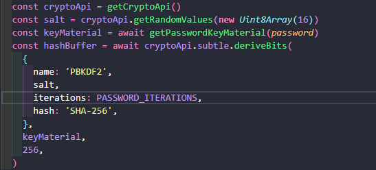

# Orbital Guardian ReadMe
Sistema de monitoramento e gerenciamento de informações críticas relacionadas ao ecossistema espacial, desenvolvido como parte da Global Solution do curso de Engenharia de Software da FIAP.

## Sobre o Projeto
O Orbital Guardian foi desenvolvido para auxiliar operadores no monitoramento de eventos, alertas e informações relevantes para ambientes que dependem de dados espaciais e sistemas de observação.

A plataforma centraliza informações estratégicas em uma interface intuitiva, permitindo acompanhamento de alertas, regiões monitoradas, sensores e análises operacionais.

## Objetivos
* Monitorar eventos e alertas críticos.
* Centralizar informações operacionais.
* Melhorar a rastreabilidade de eventos.
* Garantir maior confiabilidade dos dados processados.
* Aplicar boas práticas de segurança da informação.

## Arquitetura do Projeto

```bash
src/
    components/
    context/
    data/
    lib/
    pages/
    security/
        auditLogger.js
        cryptoService.js
        validators.js
    services/
    App.jsx
```

## Módulo de Cibersegurança
Como parte da disciplina de Cibersegurança, foram implementados controles para proteção da aplicação e dos dados armazenados.

## Controles Implementados

### 1. Controle de Acesso (IAM)
A aplicação utiliza autenticação para restringir o acesso às funcionalidades internas.

Rotas protegidas impedem que usuários não autenticados acessem recursos sensíveis.

### 2. Validação de Entradas
Todos os dados fornecidos pelos usuários passam por validação antes do processamento.

### 3. Criptografia de Dados Sensíveis
Informações confidenciais são protegidas utilizando:

* AES-GCM
* Web Crypto API

A criptografia garante a confidencialidade dos dados armazenados.

### 4. Proteção de Credenciais
As senhas são protegidas utilizando:

* PBKDF2
* SHA-256
* Salt aleatório
* 120.000 iterações

Essa abordagem reduz significativamente os riscos de ataques de força bruta.

## Auditoria e Monitoramento
Eventos críticos são registrados automaticamente através do módulo de auditoria.

.png)

## Análise de Riscos
Foi utilizada uma adaptação simplificada da metodologia STRIDE para identificação das principais ameaças.

<table class="stride-table">
  <thead>
    <tr>
      <th scope="col">Ativo</th>
      <th scope="col">Ameaça Mapeada</th>
      <th scope="col">Impacto Potencial</th>
    </tr>
  </thead>
  <tbody>
    <tr>
      <td><strong>Sistema de autenticação</strong></td>
      <td>Acesso não autorizado</td>
      <td>Comprometimento de contas</td>
    </tr>
    <tr>
      <td><strong>Banco de dados</strong></td>
      <td>Vazamento de dados</td>
      <td>Exposição de informações sensíveis</td>
    </tr>
    <tr>
      <td><strong>Sistema de alertas</strong></td>
      <td>Manipulação de dados</td>
      <td>Alertas incorretos</td>
    </tr>
    <tr>
      <td><strong>Armazenamento</strong></td>
      <td>Alteração indevida</td>
      <td>Perda de integridade</td>
    </tr>
    <tr>
      <td><strong>Aplicação Web</strong></td>
      <td>Indisponibilidade</td>
      <td>Interrupção dos serviços</td>
    </tr>
  </tbody>
</table>

## Tecnologias de Segurança Utilizadas
* AES-GCM
* PBKDF2
* SHA-256
* Web Crypto API
* Controle de acesso baseado em autenticação
* Logs de auditoria
* Validação de entradas

## Como Executar o Projeto
Instalar dependências

```bash
npm install
```

Executar ambiente de desenvolvimento
```bash
npm run dev
```

Build de produção
```bash
npm run build
```

## Evidências da Implementação
***cryptoService.js***
Responsável por:
* Criptografia AES-GCM
* Derivação de chaves
* Hash de senhas com PBKDF2
* Verificação de credenciais

## Implementação da Criptografia AES-GCM
O sistema utiliza a Web Crypto API para criptografar informações sensíveis antes do armazenamento.

A criptografia é realizada utilizando o algoritmo AES-GCM, considerado atualmente uma das abordagens mais seguras para proteção de dados em aplicações web modernas.

***Figura 1 – Implementação da criptografia AES-GCM***

.png)

## Configuração da Proteção de Senhas
As credenciais dos usuários são protegidas utilizando PBKDF2 com SHA-256 e 120.000 iterações.

Essa abordagem aumenta significativamente o custo computacional de ataques de força bruta e dificulta a recuperação de senhas mesmo em cenários de comprometimento do armazenamento.

***Figura 2 – Configuração dos parâmetros de proteção de senhas***



## Objetivos de Desenvolvimento Sustentável (ODS)
O projeto contribui diretamente para:

### ODS 9 - Indústria, Inovação e Infraestrutura
Desenvolvimento de soluções tecnológicas seguras e resilientes.

### ODS 11 - Cidades e Comunidades Sustentáveis
Apoio a sistemas de monitoramento e tomada de decisão.

### ODS 16 - Paz, Justiça e Instituições Eficazes
Fortalecimento da segurança da informação e proteção dos dados.

## Equipe
Vinicius Henrique - RM556908

Enzo Dias - RM558225

Gustavo Pierre - RM558928

Gabriel Belo - RM551669

Laura Souza - RM556320

## Projeto Acadêmico
Projeto desenvolvido para a Global Solution - FIAP, integrando conceitos de Engenharia de Software, Arquitetura de Sistemas e Cibersegurança aplicados ao contexto do ecossistema espacial.
